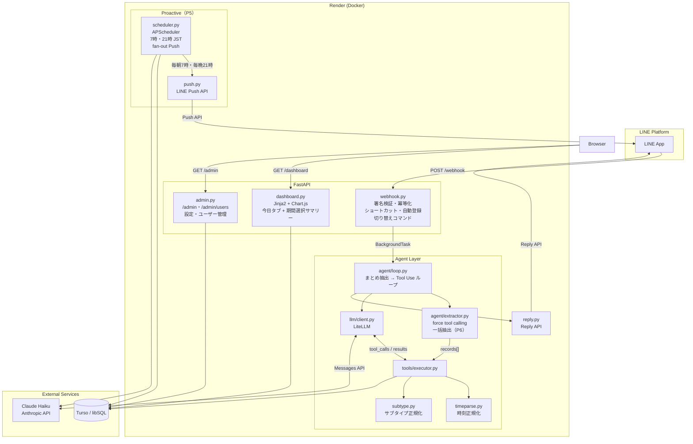
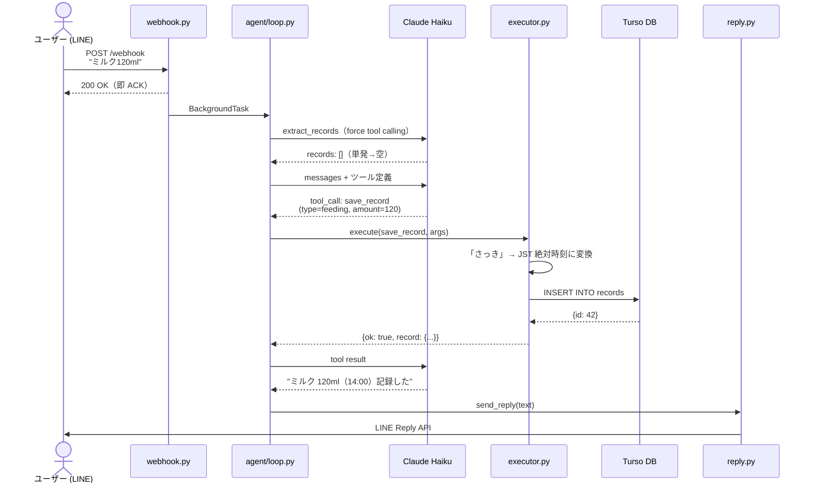
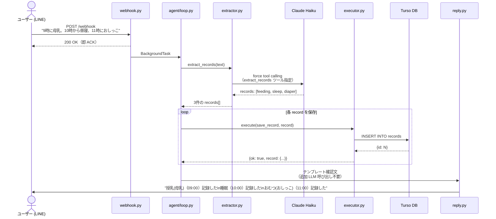

# koto-log — 育児記録エージェント（LINE × Tool Use）

授乳・睡眠・おむつなどの育児記録を、**自然言語の対話だけ**で記録・集計・修正できる
エージェント。「3時に120ml飲んだ」と打てば構造化して保存し、「今日何回飲んだ？」と
聞けば集計して返す。中核は LLM の **Tool Use**：入力に応じて LLM が「どのツールを・
どの引数で呼ぶか」を判断し、アプリ側のコードが DB を更新・参照する。

> ステータス: **P10 一部実装済み（P7〜P10 含む / Render + Turso + Claude Haiku で本番稼働中）**
> URL: `https://koto-log.onrender.com`

## できること

- 自由文を解釈して `feeding / sleep / diaper / temp / baby_food / bath / medicine / hospital / outing` を構造化保存
  （例: 「3時にミルク120ml」「さっき寝た」「うんちした」「離乳食50g」「お風呂入れた」「薬飲んだ」）
- **まとめ入力**（P6）：複数記録を1文で一括登録
  （例: 「9時に母乳、10時から11時まで昼寝、11時におしっこ交換」→ 3件を1回の LLM 呼び出しで保存）
- 期間・種別・サブ種別を指定した集計（例: 「今日は何回飲んだ？」「母乳は何回？」）
- 「今日のまとめ」「前回の授乳はいつ？」などの振り返りクエリ
- 直近記録の修正・取り消し（例: 「150に直して」「さっきのなし」）
- 「操作一覧」「help」「？」で使い方を即返答（LLM バイパス）
- **複数児対応**（P9.2）：名前明示・`users.current_child_id`・既定児の優先順で対象児を自動解決。複数児がいる場合は確認文に児名を表示
- **ユーザー自動登録**（P9.3）：LINE からメッセージが届くたびに `users` テーブルへ自動登録。ニックネームは保持される
- **「〇〇に切り替え」コマンド**（P9.3）：対象児を切り替える（そのユーザーの `current_child_id` を更新）
- ダッシュボード（`/dashboard`）でウォームカラーの今日タブ（サマリーカード＋時系列タイムライン）を表示。授乳・睡眠・おむつのサマリーグラフを **7日 / 14日 / 30日** で切り替え可能
- 管理画面（`/admin`）でブラウザから出産予定日を設定
- 管理画面（`/admin/records`）で記録を **AI を介さず手動で追加・編集・削除**（取りこぼし入力や誤抽出の確実な修正用、時刻は `datetime-local`）
- 管理画面（`/admin/users`）でユーザー一覧・ニックネーム・通知設定・対象児・削除を管理（P9.3）
- **毎朝7時**に出産カウントダウン + LLM 一言を **notify_enabled の全ユーザーへ** LINE Push（P9.3 fan-out）
- **毎晩21時**に当日の育児サマリーを **notify_enabled の全ユーザーへ** LINE Push（記録なしはスキップ）
- LINE チャット内から `due_date` を設定（`set_config` ツール）
- ローカル Ollama で完全無料動作。`KOTOLOG_MODEL` の変更だけで Claude へ切替可能

## LLM が担うこと・担わないこと

設計の核心は「**LLM に決めさせる範囲を最小化する**」こと。
LLM は意図の解釈とツール選択だけを担い、計算・DB操作・時刻解決はアプリコードが確定値で行う。

| | 担当 | 理由 |
|---|---|---|
| 「うんち」→ `diaper` と判断する | **LLM** | 自然言語の解釈 |
| どのツール（save/query/update）を呼ぶか | **LLM** | 意図の分類 |
| まとめ文から全記録を一括抽出する（P6） | **LLM** | force tool calling で構造化 |
| `started_at="さっき"` をそのままツールに渡す | **LLM** | 変換は行わない |
| 「さっき」→ JST 絶対時刻に変換する | **アプリ** (`timeparse.py`) | LLM は時刻計算しない |
| 「粉ミルク」→「ミルク」に正規化する | **アプリ** (`subtype.py`) | 集計ブレを防ぐ |
| DB に INSERT / SELECT する | **アプリ** (`crud.py`) | LLM は SQL を書かない |
| 件数・合計量・経過時間を計算する | **アプリ** (`executor.py`) | LLM は数え直さない |
| 計算結果を自然な文章にする | **LLM** | 文章生成 |
| 情報不足なら聞き返す | **LLM** | 対話の制御 |
| 毎朝の Push 通知テキストを生成する | **LLM** | パーソナルな一言 |

## アーキテクチャ

### コンポーネント図



### メッセージ処理シーケンス図（単発記録）



### まとめ入力シーケンス図（P6）



> 外部サービス（LINE / Anthropic / Turso / Render / Ollama）のセットアップ手順は [docs/external-services.md](docs/external-services.md) を参照。

## プロジェクト構成

```
src/kotolog/
├── types.py            # RecordType / FeedingSubType / DiaperSubType enum
├── config.py           # .env からの設定読込
├── db/                 # connection・crud・schema.sql・migrations（schema_migrations）
├── utils/
│   ├── timeparse.py    # 相対時刻 → JST絶対時刻
│   └── subtype.py      # sub_type 表記ゆれ正規化
├── tools/              # definitions(JSONスキーマ) / executor(DB操作)
├── llm/client.py       # LiteLLM ラッパ（local⇄Claude、tool_choice 対応、使用量計測シーム）
├── obs/usage.py        # トークン使用量の最小計測（UsageEvent / 差替可能 Sink、P7）
├── agent/
│   ├── loop.py         # まとめ抽出 → tool-use ループ（フォールバック解析付き）
│   └── extractor.py    # force tool calling による一括記録抽出（P6）
├── templates/
│   ├── dashboard.html        # 今日タブ（サマリーカード+タイムライン）+ 期間選択グラフ（7/14/30日）
│   ├── admin.html            # 設定管理画面（予定日）
│   ├── admin_records.html    # 記録 CRUD 一覧（期間・種別フィルタ＋編集/削除）
│   ├── admin_record_form.html # 記録の追加/編集フォーム（datetime-local）
│   └── admin_users.html      # ユーザー管理画面（ニックネーム・通知・対象児・削除）
├── line/
│   ├── webhook.py      # FastAPI app / 署名検証 / 冪等化 / 自動登録 / 切り替えコマンド
│   ├── dashboard.py    # /dashboard ルーター
│   ├── admin.py        # /admin ルーター（設定 + テスト Push + 記録 CRUD + ユーザー管理）
│   ├── push.py         # LINE Push API クライアント
│   ├── scheduler.py    # APScheduler（7時カウントダウン・21時サマリー・fan-out Push）
│   └── reply.py        # LINE Reply API クライアント
└── cli.py              # 対話CLI エントリ（LINE と同じ Agent を共有）
evals/                  # ツール選択の正答率評価
tests/                  # unit / integration / e2e
docs/
├── external-services.md  # 外部サービスの URL・セットアップ手順
└── adr/
    ├── 0001-scheduler-apscheduler-in-process.md
    ├── 0002-token-usage-measurement.md
    ├── 0003-admin-record-crud.md
    ├── 0004-admin-menu-and-user-management.md
    ├── 0005-multi-child-strategy.md
    └── 0006-p9-user-child-data-model.md
```

## ローカル開発セットアップ

### 前提
- [uv](https://docs.astral.sh/uv/)（パッケージ管理）
- Ollama（ローカル LLM）

### 手順

```bash
# 依存をインストール
uv sync

# Ollama を Docker で起動
docker run -d --name kotolog-ollama -p 11434:11434 \
  -v docker_ollama:/root/.ollama ollama/ollama:latest
docker exec kotolog-ollama ollama pull qwen2.5:7b

# 設定ファイルを用意
cp .env.example .env   # 必要に応じて編集

# CLI で起動
uv run kotolog

# LINE Webhook サーバとして起動（ngrok でトンネル）
uv run uvicorn kotolog.line.webhook:app --reload --port 8000
```

## 本番環境（Render + Turso + Claude）

### 構成

| コンポーネント | サービス | 備考 |
|---|---|---|
| アプリ | Render (Docker) | `render.yaml` で設定 |
| DB | Turso (libSQL) | SQLite 互換のクラウド DB |
| LLM | Claude Haiku 4.5 | `anthropic/claude-haiku-4-5-20251001` |

### 環境変数（Render ダッシュボードで設定）

| 変数 | 説明 |
|---|---|
| `KOTOLOG_MODEL` | `anthropic/claude-haiku-4-5-20251001` |
| `KOTOLOG_API_KEY` | Anthropic API キー |
| `KOTOLOG_DB_URL` | `libsql://koto-log-xxxx.turso.io` |
| `TURSO_AUTH_TOKEN` | Turso 認証トークン |
| `LINE_CHANNEL_SECRET` | LINE チャネルシークレット |
| `LINE_CHANNEL_ACCESS_TOKEN` | LINE アクセストークン |
| `KOTOLOG_DASHBOARD_TOKEN` | ダッシュボード認証トークン（未設定で認証なし） |
| `KOTOLOG_DEFAULT_CHILD` | `baby`（render.yaml に記載済み。P9.1 以降は DB に子が存在しない初回起動のシード名として使用） |

> 出産予定日・LINE ユーザー ID は `/admin` 画面または LINE チャット内で設定。環境変数不要。

### デプロイ

```bash
git push  # main への push で Render が自動デプロイ
```

## 全環境共通の設定（環境変数）

| 変数 | 既定 | 説明 |
|---|---|---|
| `KOTOLOG_MODEL` | `ollama_chat/qwen2.5:7b` | LiteLLM のモデル文字列 |
| `KOTOLOG_API_KEY` | （空） | ホスト型モデル用 API キー |
| `KOTOLOG_OLLAMA_BASE` | `http://localhost:11434` | Ollama のベース URL |
| `KOTOLOG_DB_URL` | `kotolog.db` | DB URL（Turso: `libsql://...`） |
| `TURSO_AUTH_TOKEN` | （空） | Turso 接続トークン |
| `KOTOLOG_DEFAULT_CHILD` | `baby` | 初回起動時のシード子名（P9.1 以降、既定児は DB 管理） |
| `LINE_CHANNEL_SECRET` | （LINE利用時必須） | 署名検証に使用 |
| `LINE_CHANNEL_ACCESS_TOKEN` | （LINE利用時必須） | Reply/Push API に使用 |
| `KOTOLOG_DASHBOARD_TOKEN` | （空） | ダッシュボード URL トークン |
| `KOTOLOG_USAGE_LOG` | （空） | `1`/`true` でトークン使用量を 1行 JSON ログ出力（P7） |

## LINE リッチメニュー推奨構成

| マス | ラベル | 送信テキスト |
|---|---|---|
| 1 | 母乳 | `母乳` |
| 2 | ミルク | `ミルク` |
| 3 | うんち | `うんち` |
| 4 | おしっこ | `おしっこ` |
| 5 | 寝た / 起きた | `寝た` / `起きた` |
| 6 | 操作一覧 | `操作一覧` |

## テスト

```bash
uv run pytest                                        # 全テスト（live は自動スキップ）
uv run pytest tests/unit/                            # 単体テストのみ
uv run pytest tests/unit/ --cov --cov-report=term-missing  # カバレッジ付き
uv run pytest -m live                                # 実 Ollama E2E（要起動）
```

| 層 | 置き場所 | 内容 |
|---|---|---|
| 単体 (unit) | `tests/unit/` | 純ロジック。DB/ネットワーク非依存。FakeLLM パターンを使用 |
| 結合 (integration) | `tests/integration/` | 実 DB・複数コンポーネント結線 |
| E2E | `tests/e2e/` | 入口からの一気通し |

## ロードマップ

| フェーズ | 内容 | 状態 |
|---|---|---|
| P1 Core (CLI) | 記録・集計・修正・確認サマリ | ✅ 完了 |
| P1.5 MVP+ | 集計強化・sub_type正規化・前回いつ・まとめ | ✅ 完了 |
| P2 LINE | Webhook・署名検証・冪等化・Reply API | ✅ 完了 |
| P3 Deploy | Dockerfile + Render + Turso + Claude Haiku | ✅ 完了 |
| P4 Enhance | ダッシュボード（今日タブ・ウォームデザイン・期間選択・タイムライン） | ✅ 完了 |
| P5 Proactive | APScheduler・毎朝カウントダウン・毎晩サマリー・管理画面 | ✅ 完了 |
| P6 Structured Output | まとめ入力・force tool calling 一括抽出 | ✅ 完了 |
| P7 可観測性 | トークン使用量の最小計測（operation 別 JSON ログ・Langfuse 移行可能） | ✅ 完了 |
| P8 記録 CRUD | 管理画面で記録を AI なし手動 追加・編集・削除（`/admin/records`） | ✅ 完了 |
| P9.0 マイグレーション基盤 | `schema_migrations` + `migrate()` による前進適用・baseline スタンプ | ✅ 完了 |
| P9.1 データモデル拡張 | `users` テーブル追加・children 複数 CRUD・既定児を DB 管理（ADR-0006） | ✅ 完了 |
| P9.2 対象児解決 | `resolve_child_id`（名前明示→current→既定→単一児）・per-request executor・確認文に児名 | ✅ 完了 |
| P9.3 共有・自動登録 | `upsert_user` 自動登録・切り替えコマンド・Push fan-out・`/admin/users` | ✅ 完了 |
| P10 記録項目拡充 | ピヨログ互換の5種別追加（離乳食・お風呂・薬・病院・外出）| ✅ 完了 |
| 今後 | P11 成長曲線 / P12 予防接種リマインド | — |

詳細なタスク分解は [開発計画.md](開発計画.md) を参照。
